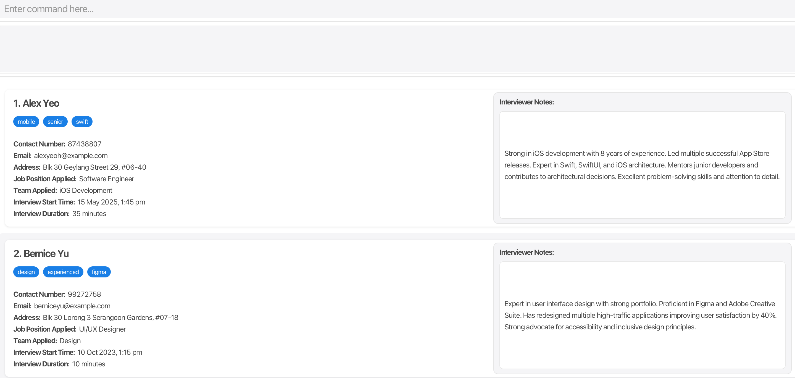

[](https://github.com/AY2425S2-CS2103T-F14-3/tp/actions)



# RecruitIntel

## Overview

RecruitIntel is a **desktop application designed specifically for Apple's HR recruiters** to efficiently manage candidate information. While offering an easy-to-use visual interface, it features powerful text commands that help process candidate information considerably faster than traditional mouse-based applications.

## Features

* **Candidate Management**
    * Add candidates with detailed information
    * Edit existing candidate records
    * Delete candidate records
    * List all candidates in the system

* **Advanced Categorization**
    * Classify candidates by skills, teams, and positions
    * Tag candidates with relevant skills and attributes
    * Find candidates by name with partial matching

* **Interview Management**
    * Schedule interviews with specific times and durations
    * Sort candidates by interview times
    * Add detailed notes about interview performance

* **User Experience**
    * Data is automatically saved
    * Fast command-based interface
    * Undo/redo functionality for most operations

## Quick Start

1. Ensure you have Java `17` or above installed.
2. Download the latest `RecruitIntel.jar` from the [releases page](https://github.com/AY2425S2-CS2103T-F14-3/tp/releases).
3. Create a dedicated folder for RecruitIntel.
4. Copy the downloaded JAR file into this folder.
5. Run the application:
   ```
   java -jar recruitintel.jar
   ```

## Command Examples

* **Adding a candidate**:
  ```
  add n/John Doe p/98765432 e/johnd@example.com a/John street, block 123, #01-01 j/Software Engineer tm/IOS Development t/Swift
  ```

* **Scheduling an interview**:
  ```
  interview 1 2025-04-01 10:00 40
  ```

# Installation
## Prerequisites

Java (JDK 17 zulu version)
Gradle

## Steps

### Clone the Repository

```
git clone https://github.com/AY2425S2-CS2103T-F14-3/tp.git
cd tp
```
### Build the Project

```
gradle build        # Using Gradle
```

### Run the Application
```
java -jar RecruitIntel.jar   # Running the JAR
```

# Acknowledgements
This project is based on the AddressBook-Level3 project created by
the [SE-EDU initiative](https://se-education.org).
